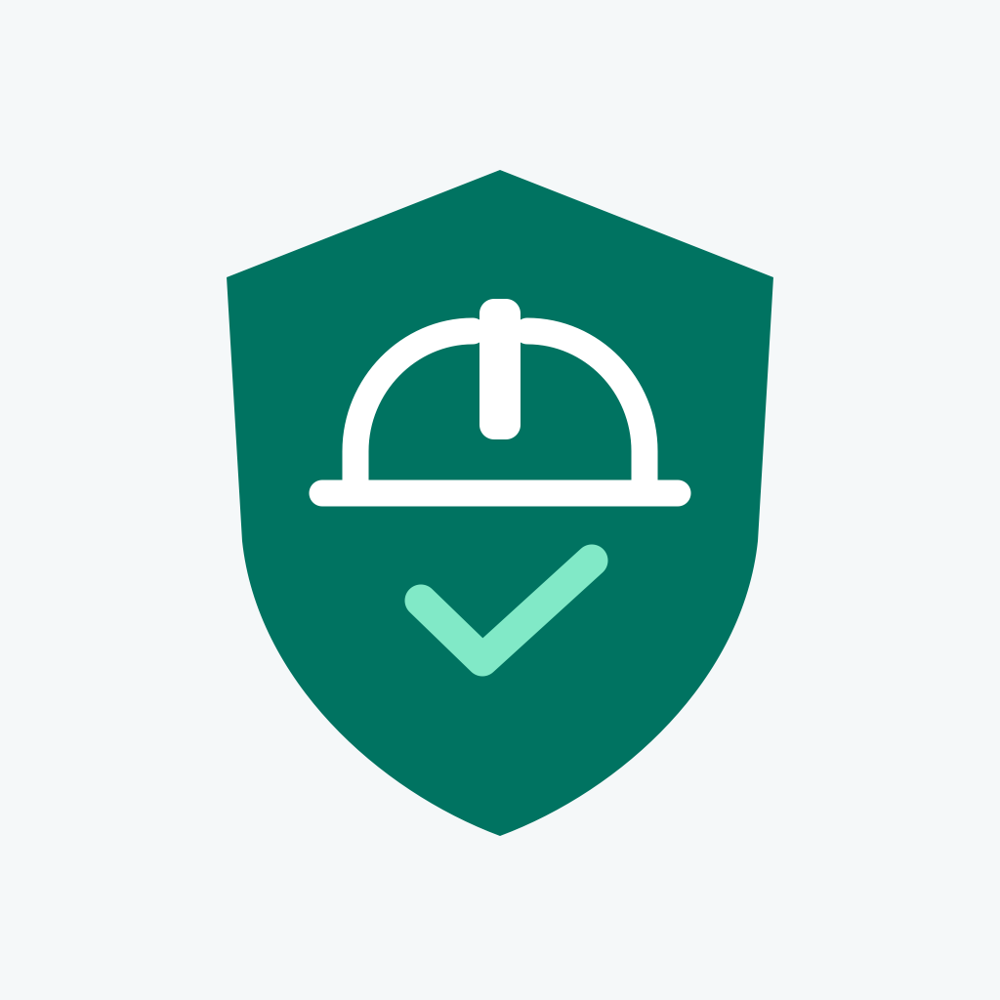

<p align="center"></p>

# Salamah · SafetyLens AI

**Industrial safety assistance, built for the worker's point of view.**

Agent X Hackathon — Eastern Province Edition

SafetyLens brings protective equipment checks, work-zone awareness and incident reporting into one iPhone application. A worker can check PPE, see nearby safety zones through the camera, report a hazard by voice and review the resulting records in a local operations dashboard.

The project explores a practical question: how can a phone help workers notice a risk, act on it and leave a useful record without adding another complicated workflow?

## The problem

Industrial sites rely on protective equipment, clear boundaries and timely reporting. These controls are often handled separately. A missed helmet check, an unnoticed restricted area and an unrecorded hazard can all disappear between the field and the report.

SafetyLens connects those steps:

**Observe → assess → warn → record → review**

## What the MVP does

| Capability | Implementation |
| --- | --- |
| Live PPE checks | Selected camera frames processed on iPhone with Core ML and Apple Vision; configurable required equipment and confidence threshold. |
| Safety zones | Native Apple Maps on iOS, with circles and polygons drawn by touch, saved locally. |
| Explore surroundings | Camera and ARKit overlays show nearby zones, direction and approximate distance. |
| Voice commands | Live Arabic speech-to-text through iOS; the worker presses Stop to submit the command. |
| Visual assistance | A clear request such as “What is in front of me?” captures one fresh frame for cloud analysis and returns text and speech. |
| Incident history | PPE observations, zone events and voice hazard reports stored in SQLite. |
| Operations dashboard | Counts and summaries derived from saved records, with tasks and guided progress. |

The mobile interface is Arabic with right-to-left layout. This repository's documentation is in English. The current app version is **1.4.4 (9)**. iOS is the validated platform; Android remains a future target.

## Designed for the field

Continuous PPE scanning reads raw frames from the live camera stream. It accepts at most one frame every 500 ms, allows only one inference at a time and drops extra frames. It does not repeatedly take still photographs or accumulate a processing queue.

PPE inference runs locally. Voice assistance is a separate, optional cloud feature. The API key stays on a small Python gateway; the app receives only the gateway connection settings. A visual request sends one selected image, not the live video stream.

Zone and event data remain available offline. Map content, cloud image analysis and generated speech require connectivity. iOS speech recognition may use Apple's online service if local recognition is unavailable.

## Run on iPhone

Prerequisites: macOS, Xcode with iOS support, Flutter compatible with Dart 3.11, CocoaPods, and an iPhone configured for development. AR requires a compatible physical device. The iOS target is 15 or later.

```sh
flutter pub get
open ios/Runner.xcworkspace
```

In Xcode, select the **Runner** scheme, choose your signing team and connected iPhone, then run. The repository contains the project's existing development-team setting; replace it with your own for a different account.

Alternatively:

```sh
flutter run --release -d <iphone-id>
```

Allow Camera and Location access for the field features. Voice Commands additionally needs Microphone and Speech Recognition permissions. Local PPE and saved records do not need an OpenAI or Roboflow key.

For the optional assistant, follow [Assistant setup](docs/ASSISTANT.md). Never put an OpenAI API key into Flutter assets, Dart defines or a mobile settings screen.

## Demo walkthrough

1. Open the dashboard. A fresh installation has no recorded measurements; it does not show invented compliance data.
2. Start a PPE check with one worker clearly visible. Review the detected equipment and the configured requirements.
3. Add a work zone and a restricted zone by touching the map.
4. Open the spatial view and observe zone direction, distance and entry feedback in a controlled test area.
5. Open Voice Commands, speak a visual request, review the live transcript and press Stop. Read or listen to the image analysis.
6. Report a hazard by voice. Return to the dashboard and confirm it appears in stored records.
7. Create a task and complete its guided steps. Refresh the optional brief to summarize the local records.

See [Demo guide](docs/DEMO.md) for preparation and interpretation.

## Project structure

```text
lib/
  core/             App state, theme and localization helpers
  models/           Safety events, zones, PPE and tasks
  services/         Camera, speech, risk, spatial and API services
  repositories/     SQLite persistence and record queries
  features/         Home, scan, zones, AR, voice, dashboard and settings
  widgets/          Shared UI components

ios/Runner/         Native Core ML, Apple Maps and ARKit integration
ai_proxy/           Optional Python gateway for the voice assistant
proxy/              Earlier Roboflow gateway; not used by local PPE
assets/             Brand assets and Arabic fonts
test/               Flutter and domain tests
integration_test/   Physical-device integration checks
tools/              Model export and development utilities
```

[Architecture](docs/ARCHITECTURE.md) · [Model and attribution](docs/ON_DEVICE.md) · [Security](SECURITY.md) · [Privacy draft](docs/PRIVACY_POLICY_DRAFT.md)

## Verification

```sh
flutter analyze
flutter test
cd ai_proxy
python3 -m venv .venv
.venv/bin/pip install -r requirements.txt
.venv/bin/python -m unittest discover
```

Physical-device tests cover camera and spatial paths separately. Unit tests and successful builds do not establish field detection accuracy. Run hardware checks with permissions granted and the intended model/device configuration.

## Current limits

- PPE results are observations, not certified compliance decisions. Occlusion, distance, lighting and model weaknesses affect detection.
- GPS and compass accuracy limit zone placement, particularly indoors. AR overlays are approximate and do not use precise geospatial anchors.
- Monitoring is foreground-only. This MVP does not provide background site surveillance or emergency dispatch.
- The assistant's interpretation does not replace the local PPE engine or the site's safety procedures.
- No employee accounts, face recognition, multi-company backend or production fleet management are implemented.
- App Store publication and a representative field evaluation are still pending.

## Next steps

Evaluate detection on representative Eastern Province worksite conditions; improve indoor positioning and spatial alignment; validate Android; and adapt the camera, positioning and display interfaces for a future smart-helmet client.

## Attribution and licensing

The PPE model is adapted from **SafetyVision YOLOv8s PPE v2**, published by Ayush Gupta, with upstream model weights identified as AGPL-3.0. Its original model card and license are retained. IBM Plex Sans Arabic is distributed under the SIL Open Font License. See [Third-party notices](THIRD_PARTY_NOTICES.md).

This submission does not claim authorship of upstream models or libraries. No blanket license grant is made for original application code in this repository; third-party components retain their respective terms.
